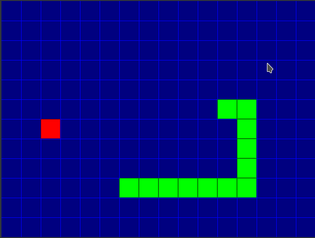

# Simple Stake SLD WiiU Port
This project is my first WiiU port!!!!

I hope that will be more to came.

The objective was not made an elegant port of a well made big project, all the contrary, the idea was port the simplest thing I can find in order to learn and made my life easy on the process ;).

Original  SDL code:  
https://codereview.stackexchange.com/questions/150450/implementation-of-snake-game-using-sdl2-and-c  
Not sure if there is an official repo for this code. I found it on codereview.stackexchange.com

## Future of this repo
Actually not sure about the future :D. For sure organize a bit more the code. 
Use animated sprites instead of geometry rendering will be fine too. But not sure since this will make more complex the code. The idea is to keep it simple so probably a future other better-looking Snake port for the WiiU will go to another repo. I will let the link here if I make it.

## Special Thanks

* [rw-r-r-0644](https://github.com/rw-r-r-0644) for it's help and guidance in moments when nothing wanted to compile and link correctly. 
* [yawut](https://github.com/yawut) Team for SDL port to the WiiU and wonderful tools.   
* [devkitpro Team](https://devkitpro.org/)
* All the people team the made homebrew possible on the wiiU

## Building instructions

I recomend a Linux Debian like operational system for better tools compatibility:
* Install [devkitpro](https://devkitpro.org/wiki/Getting_Started#Unix-like_platforms)
* Install [wiiu-fling](https://gitlab.com/QuarkTheAwesome/wiiu-fling)
* On a terminal install needed libraries:  
  `sudo dkp-pacman -Syu wiiu-libromfs wiiu-sdl2 wiiu-sdl2_gfx wiiu-sdl2_image wiiu-sdl2_mixer wiiu-sdl2_ttf`
* Clone this repo:  
  `git clone https://github.com/ulquiorra-dev/Simple_SDL_Snake_WiiU_Port.git`

* `cd Simple_SDL_Snake_WiiU_Port`
* `make`
* Enjoy this crapy looking port ;)
